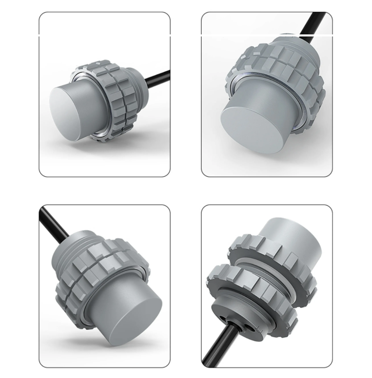
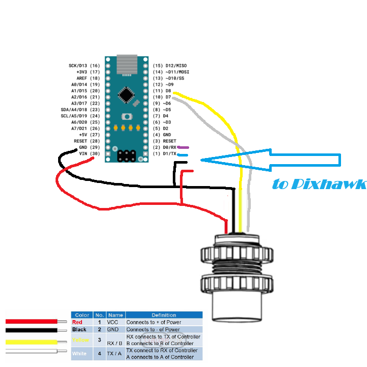

# Sonar to: i2c, NMEA, MAVLINK
The sensors shown below can be used to determine depth and obstacles. The MAVLINK protocol is used to detect obstacles, and NMEA is used to determine the depth. This repository has full descriptions with

Supported sonar models:
- L041MTW
- L042MTW
- GL041MT
- GL042MT
- A02YYUW(slightly different)

> [!NOTE]
> the project is in the process 

- [x] to nmea0183
- [x] to Mavlink
- [ ] To i2c 

----------

##  Circuit diagram:

##  ARDUPILOT SETUP:

Data from the sensor can be received using two protocols: NMEA and MAVLINK.  Based on the protocol, you need to select the desired configuration options.
The sensor can be connected to any available serial/uart port on the autopilot.
----------
   - NMEA:
     
SERIAL2_PROTOCOL = 9 (Lidar)

SERIAL2_BAUD = 115 (115200 baud)

RNGFND1_TYPE = 17 (NMEA)

RNGFND1_MIN_CM = 5

RNGFND1_MAX_CM = 600 (i.e. 6m). This is the distance in centimeters that the rangefinder can reliably read.

RNGFND1_ORIENT = 25 (i.e. down)

   - MAVLINK:
     
SERIAL2_PROTOCOL = 9 (Lidar)

SERIAL2_BAUD = 115 (115200 baud)

RNGFND1_TYPE = 10 (MAVLINK)

RNGFND1_ORIENT = 25 (i.e. down)

RNGFND1_ADDR = 1 

----------
