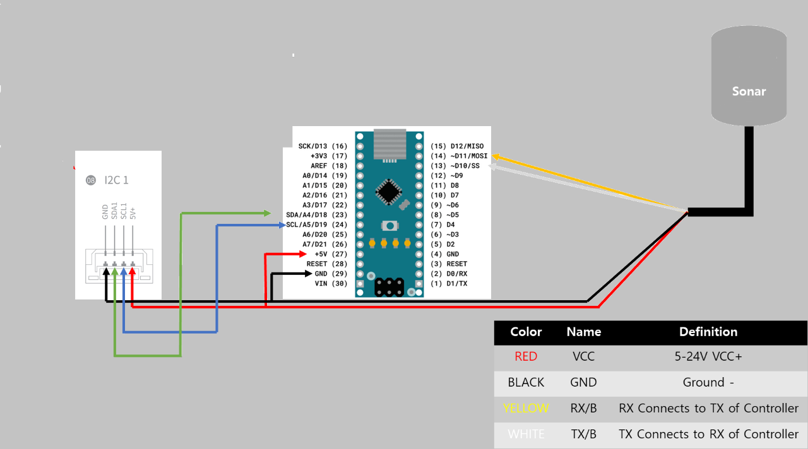

# Sonar-to-i2c-NMEA-
A cheap sonar project for autopilot based on Chinese modules. Four models(L04xMTW, GL04xMT, A02YYUW) from different manufacturers are used. It is quite possible that there are more of them, due to different manufacturers. These models have the same characteristics

##  Circuit diagram 

to i2c

----------

to nmea

## Other

